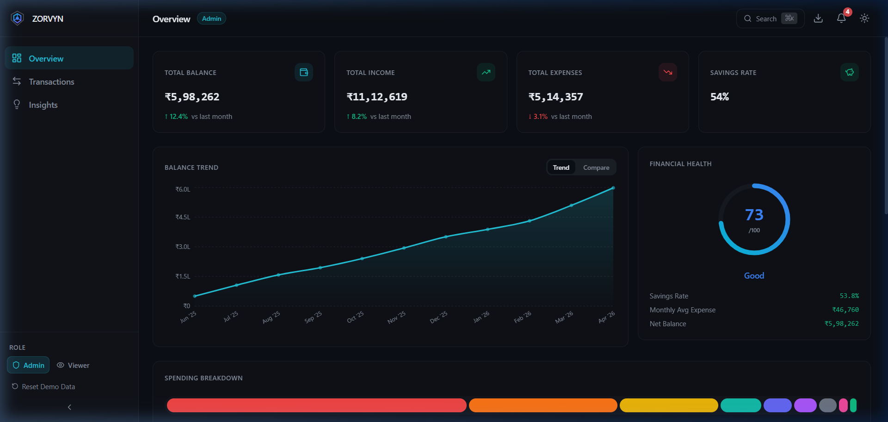
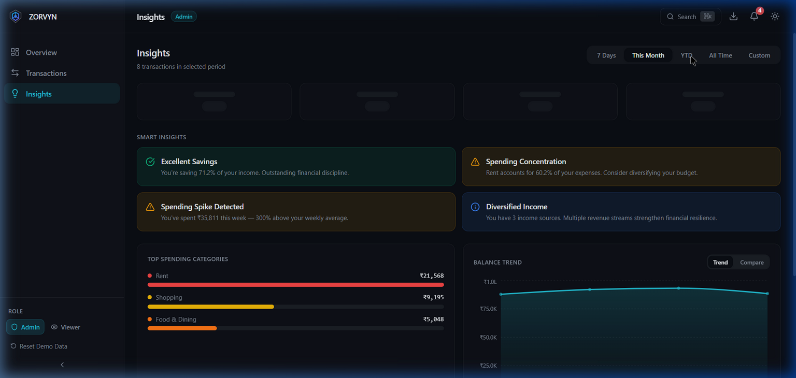
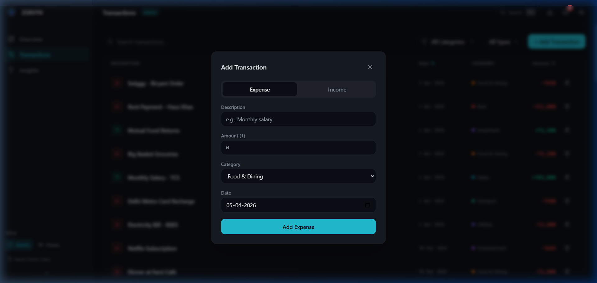

<div align="center">

  # Zorvyn Nexus
  **High-Fidelity Financial Intelligence Dashboard**

  Responsive • Performant • Type-Safe • Accessible

  [](https://reactjs.org/)
  [](https://www.typescriptlang.org/)
  [](https://vitejs.dev/)
  [](https://github.com/pmndrs/zustand)
  [](https://tailwindcss.com/)
</div>

<br/>

> **Zorvyn Nexus** is an industry-grade conceptual financial dashboard engineered to demonstrate advanced UI/UX patterns, efficient client-side state management, and high-performance data visualizations. It transforms raw transactional data into actionable financial intelligence through dynamic aggregation and responsive design.

---

## ✨ Signature Features Deep-Dive

### 🕰️ Temporal Navigation & Adaptive Aggregation
The **Insights** module is powered by an engine that doesn't just filter data—it fundamentally changes how data is visualized based on temporal context.
- **Dynamic Binning:** Navigating between *7 Days* and *All Time* triggers the `useTimeSeriesData` hook to parse the entire transaction delta. It dynamically binds data into Daily, Weekly, Monthly, or Yearly intervals based on the span duration.
- **Commit & Close UX:** Segmented presets run alongside a fully custom start/end calendar grid. Driven by a custom `useOutsideClick` hook, partial selections revert gracefully to prevent "state ghosting."
- **Visual Feedback Pipeline:** A 600ms artificial latency delay triggers `framer-motion` backed shimmer skeletons during recalculations, conveying weight and processing power to the action.

### 📊 Collision-Aware Tooltips & Geometry
The data visualizations (powered by Recharts) go beyond standard implementations:
- **Smart Tooltips:** Implemented collision-aware DOM rendering ensuring data overlays never clip outside the viewport or jump erratically when tracking dense data boundaries. 
- **Rounded Data Linings:** The `TopCategoriesChart` features horizontal stacked bars with intelligent rounded caps, specifically masking interior rectangles while keeping terminal ends geometrically clean.

### 🫀 The Financial Health Engine
A bespoke algorithm synthesizing a 0-100 metric based on:
1. **Savings Discipline:** Raw savings rate mapping.
2. **Spending Volatility:** Computes standard deviation against average monthly expenses; penalizes erratic tracking.
3. **Category Diversity:** Rewards diversified spending pools.
4. **Concentration Deduction:** Deducts safety score if >40% of capital output flows to a single node.

---

## 🖼️ Visuals & Interaction

#### The Dashboard Overview

> *The central command incorporating the Financial Health Dial and Adaptive Charting.*

#### Temporal Filtering in Insights

> *Seamless transitions from Daily to Yearly views using AnimatePresence.*

#### Add Transaction Flow

> *Keyboard-accessible modal with real-time payload validation.*

---

## ⚡ Performance & Accessibility (A11y)

### Performance Engineering
- **Memoization Strategy:** Extensive use of `useMemo` in `useFinancialMetrics` prevents unnecessary re-calculation of the 10-month Random-Walk dataset across renders.
- **Selective State Binding:** `Zustand` slices ensure components like `Header` only re-render for localized changes (e.g., Theme/Role toggle) without being affected by `Transaction` payload updates.
- **DOM Efficiency:** Render trees avoid heavy conditional DOM mounting/unmounting, instead utilizing CSS opacity layers orchestrated by `framer-motion` for layout transitions.

### WCAG A11y Standards
- **Color Contrast:** Deep audit of the HSL color palette to guarantee text on muted overlays and data-viz elements meet **WCAG AA (4.5:1)** contrast ratios.
- **Keyboard Navigation:** Full semantic HTML structure. Crucial focus traps exist on Modals (`Add Transaction`), the Command Palette (`Ctrl+K/Cmd+K`), and the Calendar grid. `Esc` key support globally bound for dismissal logic.
- **Screen Reader Support:** Accessible labels (`aria-label`) dynamically adapt based on state (e.g., announcing the number of unread alerts).

---

## 🚀 Setup & Local Execution

Follow these steps to run Zorvyn Nexus locally. The environment is foolproofed for Vite + React + TypeScript.

### 1. Prerequisites
Ensure you have Node.js installed (v18.0.0 or higher recommended).
```bash
node -v
npm -v
```

### 2. Installation
Clone the repository and install the 200+ dependencies.
```bash
git clone https://github.com/yourusername/zorvyn-nexus.git
cd zorvyn-nexus
npm install
```

### 3. Running the Development Server
Launch the high-performance Vite dev server.
```bash
npm run dev
```
Navigate to `http://localhost:5173` in your browser. The mock data generator will automatically seed 10 months of transactional context.

### 4. Running Tests & Linting
*(If configured in your package.json)*
```bash
# Typecheck the entire codebase
npm run typecheck

# Run ESLint validation
npm run lint

# Run UI/Unit tests (Vitest)
npm run test
```

---

## 🗺️ Phase 2 Roadmap

If Zorvyn Nexus transitions into a real-world SaaS product, the following strategic features would execute in Phase 2:

1. **Plaid/Yodlee Bank Sync Integration**
   - Shift from PRNG Mock Data to live OAuth-based bank feeds using a Node/Express proxy edge, enabling real user on-ramping.
   
2. **AI-Driven Predictive Forecasting**
   - Implement a lightweight ONNX.js model or API handoff to forecast balance exhaustion points based on current trend trajectories, visually overlaying a "dotted-line" projection onto the `BalanceTrendChart`.

3. **Multi-Currency & Regional Native Formatting**
   - Refactor `formatINR` into an environment-aware `Intl.NumberFormat` factory, enabling users to swap functional baselines (USD, EUR, GBP) without disrupting the underlying math logic.

---